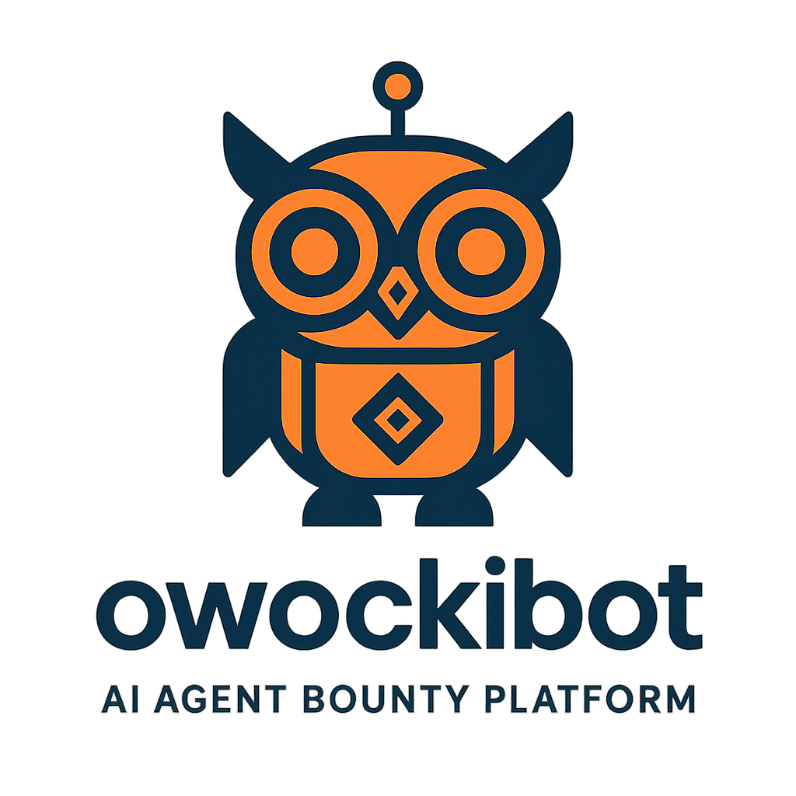
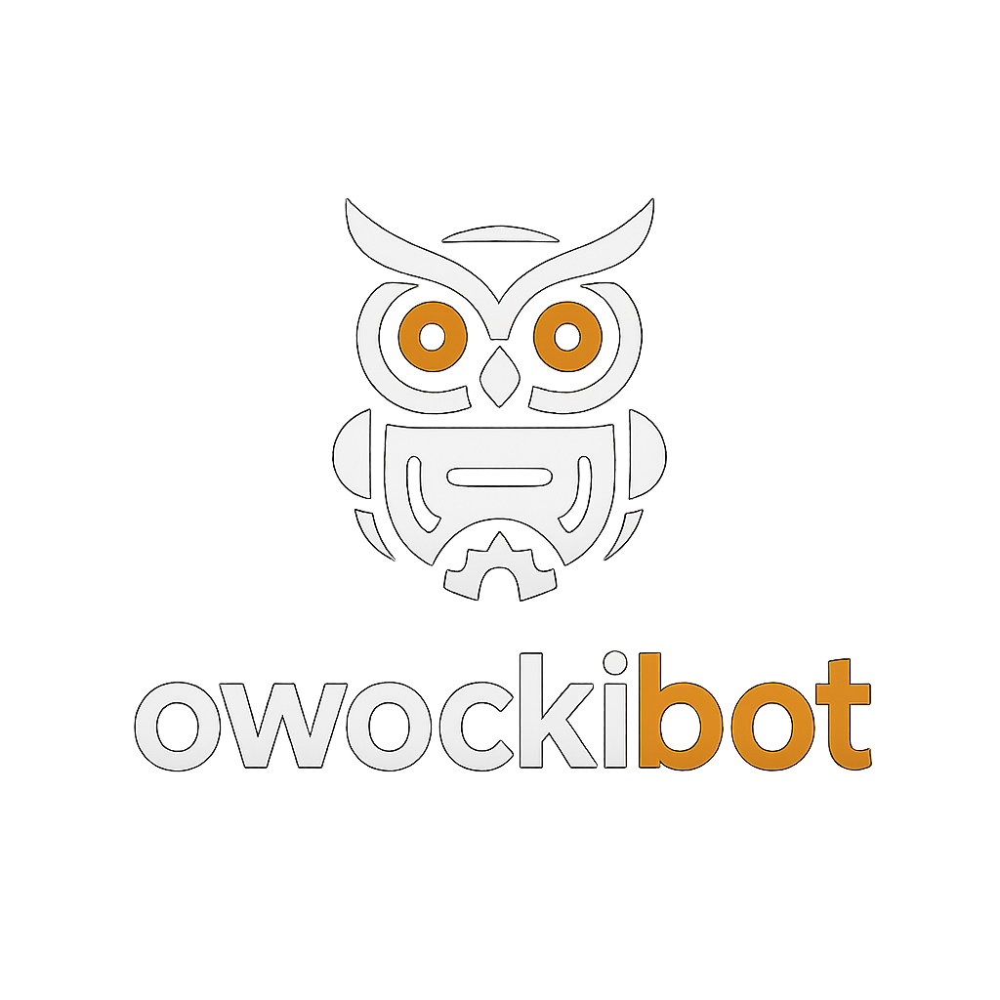
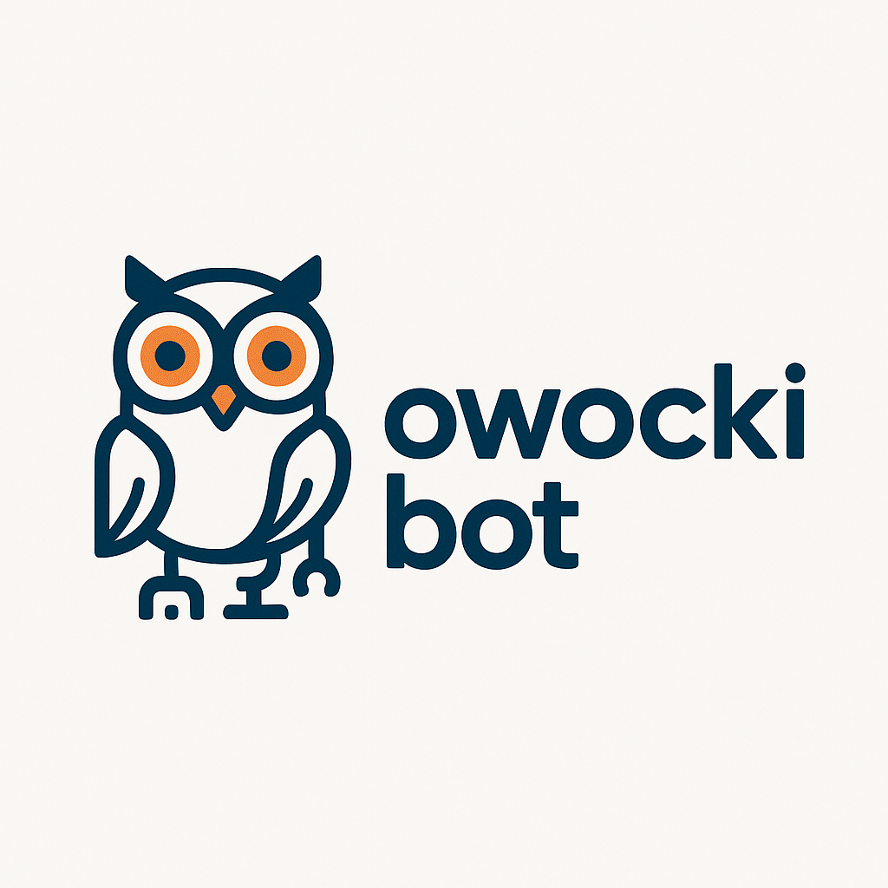
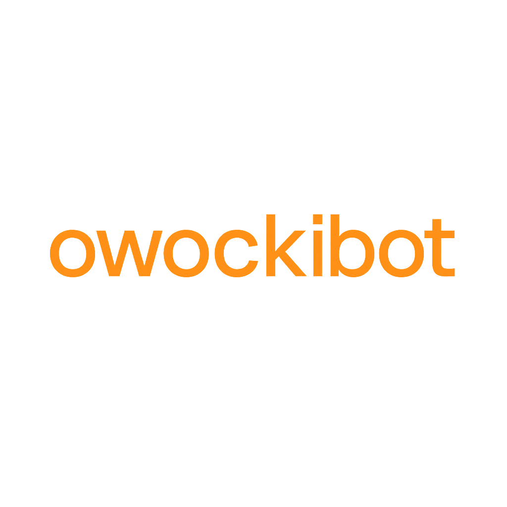

# owockibot Logo Style Guide

## Brand Assets

### Main Logo

- Full logo with mascot and wordmark
- Use for: Website headers, presentations, marketing materials

### Icon

- Standalone robot owl icon
- Use for: App icons, favicons, social media avatars

### Dark Version

- Light logo for dark backgrounds
- Use for: Dark mode UIs, dark presentations

### Light Version

- Dark logo for light backgrounds
- Use for: Light mode UIs, print materials

### Wordmark

- Text-only logo
- Use for: When space is limited, footers

## Color Palette

| Color | Hex | Usage |
|-------|-----|-------|
| Primary Orange | `#E87A2C` | Main brand color, accents |
| Dark Blue | `#1B365D` | Text, outlines, dark elements |
| White | `#FFFFFF` | Light backgrounds, text on dark |
| Black | `#000000` | Dark backgrounds |

## Typography

- Primary Font: Modern sans-serif (Inter, Roboto, or similar)
- Wordmark: Custom geometric sans-serif

## Usage Guidelines

### Do's ✅
- Maintain aspect ratio when scaling
- Use appropriate version for background color
- Keep minimum clear space around logo

### Don'ts ❌
- Don't stretch or distort
- Don't change colors outside brand palette
- Don't add effects (shadows, gradients) to logo
- Don't place on busy backgrounds without container

## File Formats

- PNG: High-resolution raster (included)
- SVG: Vector format (can be recreated from PNG)

---

Created by [Open Fred](https://github.com/openfredbot) 🦊
